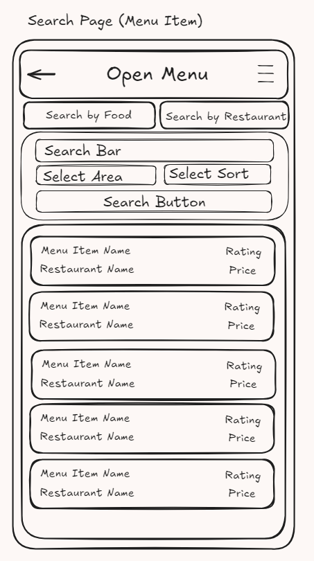
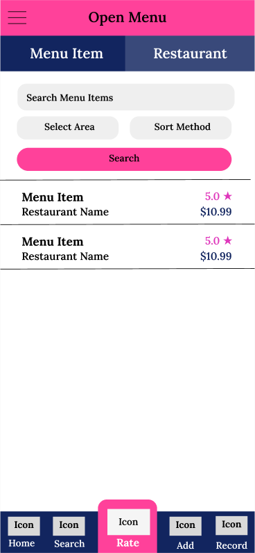

# Project Title
Open Menu

## Overview

Open Menu is a menu item-focused review app that helps foodies find and share their thoughts on the best food in their area.

### Problem Space

When a person visits a restaurant for the first time, they often have little idea how good each individual item on the menu is. Perhaps they may know that the restaurant itself has a high rating, but what about the seperate items? Perhaps the restaurant has amazing pasta, but their burgers are average. Perhaps you love curry and you saw this 4.8 star restaurant has curry so you go there, but actually they get good reviews only because of their stew. What are you to do? Read through every single review to see if they mention the item you're interested in? Well, what if instead you had a rating for each individual menu item itself.

Currently, most of the big apps for finding and reviewing places to eat such as Yelp, TripAdvisor, or Google Maps are focused on rating the restaurant as a whole. However, restaurants often have several different types of items on their menu and a single monolithic review of the store may fail to convey the individual quality of each one. Furthermore, if you're craving a very specific dish, it can be difficult to find restaurants that have it and directly compare them. Open Menu aims to assuage this problem by bringing the focus on the menu items themselves.

### User Profile

- Foodies:
    - wanting to know which dishes a restaurant does well or poorly
    - wanting to remember which menu items they've tried and how much they liked them
    - wanting to find the best of a specific food in an area

### Features

- As a user, I want to be able to search for menu items in my area
- As a user, I want to be able to search for restaurants in my area
- As a user, I want to be able to see ratings and reviews for menu items
- As a user, I want to be able to see a restaurant's menu items
- As a user, I want to be able to leave my own rating and review for a menu item

## Implementation

### Tech Stack

- React
- JavaScript
- MySQL
- Express
- Client libraries: 
    - react
    - react-router
    - axios
- Server libraries:
    - knex
    - express

### APIs

- No external APIs will be used for the first sprint

### Sitemap

- Home Page
- Search Page (User will be able to search for menu items and restaurants within a given area)
- View Menu Item (User will be able to see the details of a specific menu itme including its rating and reviews)
- View Restaurant (User will be able to see the details of a specific restaurant including its menu)
- Rating Page (User will be able to record their rating and review of a menu item)

### Mockups

**Structure Mockups (Layout of Pages w/o styles)**

#### Home Page


#### Search Page - Menu Items



#### Search Page - Restaurants


#### View Menu Item Page


#### View Restaurant Page


### Rating Page


**Style Mockups (General Aesthetic Pallette w/o accurate layout)**

#### Search Page



#### View Menu Page


#### View Restaurant Page


### Data


### Endpoints 

**GET /foods**

- Get all menu items

Parameters:
- N/A

Response:
```
[
    {
        "id": 1,
        "restaurant_id": 1,
        "name": "Big Mac",
        "rating": 4.8,
        "price": 7.79,
        "category": "Burgers"
    },
    ...
]
```

**GET /restaurants**

- Get all restaurants

Parameters:
- N/A

Response:
```
[
    {
        "id": 1,
        "name": "McDonalds",
        "category": "Fast Food",
        "address": "1280 Markham Rd, Scarborough, ON M1H 3B4",
        "area": "Scarborough",
        "average_rating": 3.8,
        "price_range": "$10 - $20"
    },
    ...
]
```

**GET /foods/:id**

- Get a specific menu item

Parameters:
- id: menu item id as a number

Response:
```
[
    {
        "id": 1,
        "restaurant_id": 1,
        "name": "Big Mac",
        "rating": 4.8,
        "price": 7.79,
        "category": "Burgers"
    }
]
```

**GET /ratings/food/:id**

- Get all reviews for a specific menu item

Parameters:
- id: menu item id as a number

Response:
```
[
    {
        "id": 1,
        "menu_item_id": 1,
        "restaurant_id": 1,
        "reviewer_name": "Ronald McDonald",
        "rating": 5,
        "timestamp": 17000000001,
        "review": "I'm Loving It!"
    },
    ...
]
```

**GET /restaurants/:id**

- Get a specific restaurant

Parameters:
- id: restaurant id as a number

Response:
```
[
    {
        "id": 1,
        "name": "McDonalds",
        "category": "Fast Food",
        "address": "1280 Markham Rd, Scarborough, ON M1H 3B4",
        "area": "Scarborough",
        "average_rating": 3.8,
        "price_range": "$10 - $20"
    }
]
```

**GET /foods/restaurant/:id**

- Get all menu items for a specific restaurant

Parameters:
- id: restaurant id as a number

```
[
    {
        "id": 1,
        "restaurant_id": 1,
        "name": "Big Mac",
        "rating": 4.8,
        "price": 7.79,
        "category": "Burgers"
    },
    ...
]
```

**POST /ratings**

- Post a review for a menu item

Parameters:
- id: menu item id as a number
- rating: rating of menu item as a number
- reviewer_name: name of reviewer as a string
- review: review text as a string

Response:
```
[
    {
        "id": 1,
        "menu_item_id": 1,
        "restaurant_id": 1,
        "reviewer_name": "Ronald McDonald",
        "rating": 5,
        "timestamp": 17000000001,
        "review": "I'm Loving It!"
    }
]
```


## Roadmap

Scope your project as a sprint. Break down the tasks that will need to be completed and map out timeframes for implementation working back from the capstone due date.

- Create client
    - react project with routes and boilerplate pages

- Create server
    - express project with routing, with placeholder 200 responses

- Create remote repositories for client and server projects

- Create migrations

- Gather sample data for 20 restaurants across 2 areas

- Create seeds with sample restaurant and menu data

- Migrate and Seed Database

- Feature: Search Page
    - Create MenuListing Component
    - Create RestaurantListing Component
    - Create and implement GET /foods request to populate list
    - Create and implement GET /restaurants request to populate list
    - Create SearchBox Component
    - Add search filtering

- Feature: View Menu Item
    - Create and implement GET /foods/:id request to populate page
    - Create Review component 
    - Create and implement GET /ratings/food/:id request to populate review section

- Feature: View Restaurant
    - Create and implement GET /restaurants/:id request to populate page
    - Create GET /foods/restaurant/:id request
    - Build menu section

- Feature: Rating Page
    - Build rating form
    - Create POST /ratings request
    - Develop rating form submission logic and function
    - Develop rating form validation
    - Add "Rate this meal" button to View Menu Item page

- Feature: Navigation
    - Create Header
    - Create Navigation Menu
    - Create Homepage
    

---

## Future Implementations
Your project will be marked based on what you committed to in the above document. Here, you can list any additional features you may complete after the MVP of your application is built, or if you have extra time before the Capstone due date.

- Log-in Function
    - Logged-in users will be able to see a record of their reviews
    - Logged-in users will be able to favorite menu items

- Add Footer navigation

- Ability to add restaurants and menu items

- Integrate Google Places / Maps

- Integrate Web-scraping to gather menu information